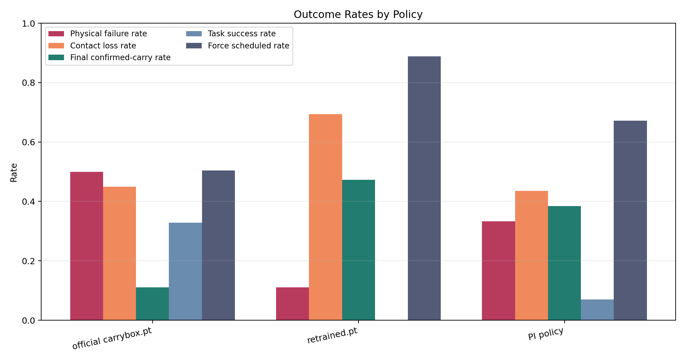
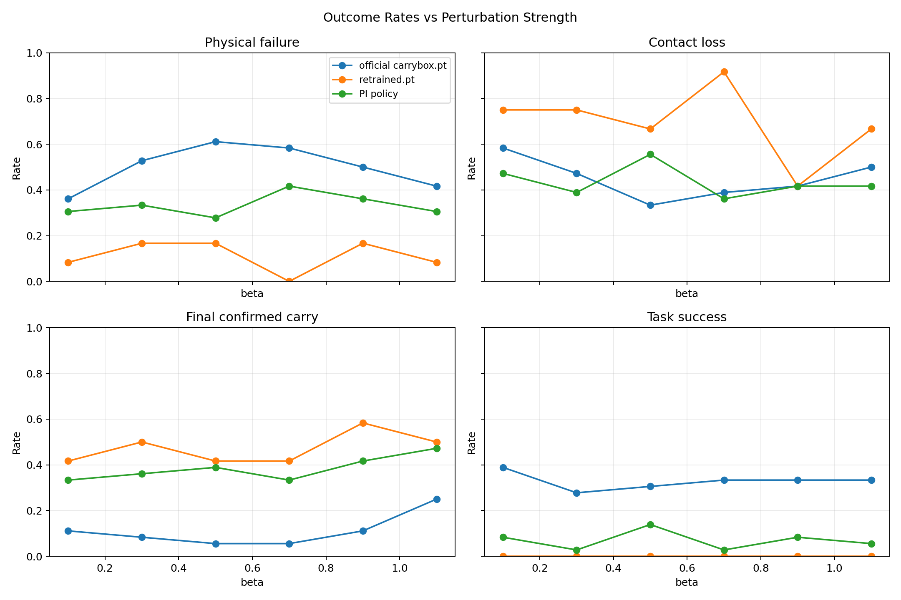
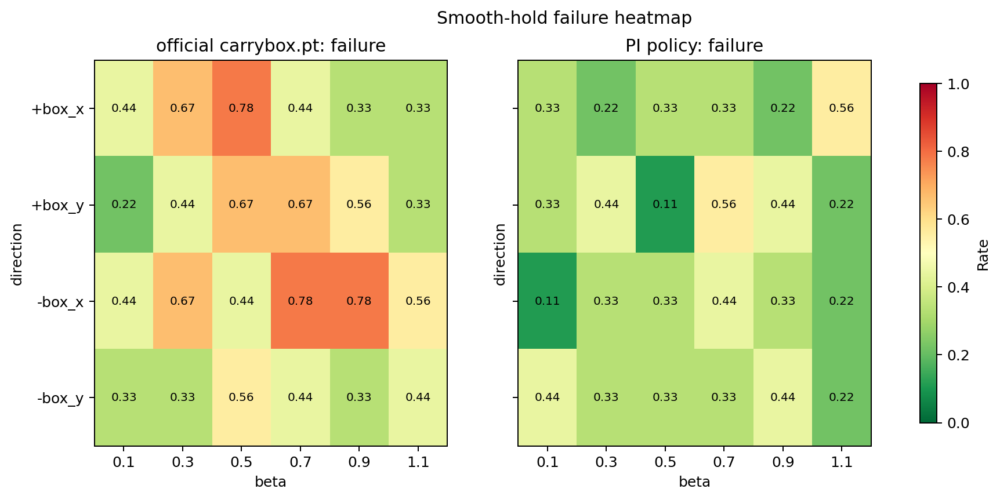
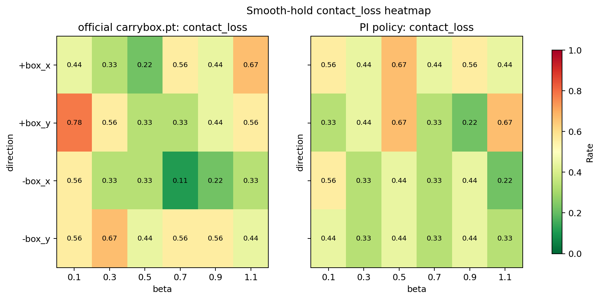
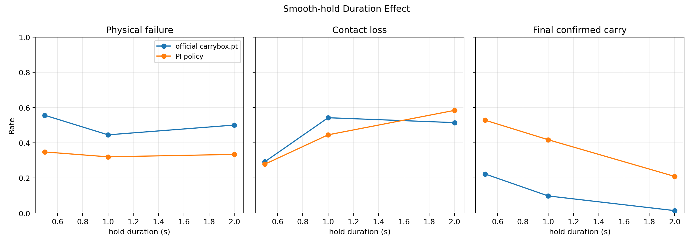
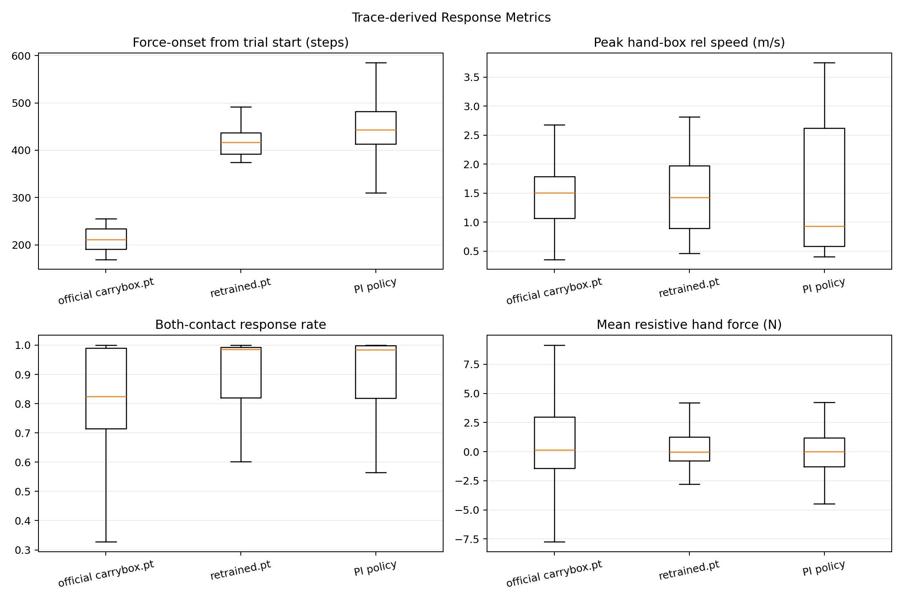

# CarryBox 扰动评估数据分析报告

## 分析范围

原始结果目录：`D:\D_Downloads\results`。

这份报告分析的是 `experiments/carrybox_perturb_debug/evaluate.py` 跑出来的三组结果：`official`、`retrained`、`pi`。评估流程不是普通 play，而是一个受控扰动实验：单环境运行，先等机器人进入 `confirmed_carry`，再延迟 0.20 s，然后在箱体 COM 施加一次外力，外力结束后继续观察 2.0 s。

`summary.csv` 的核心指标来自 `experiments/carrybox_perturb_debug/evaluation/metrics.py`；每个 trial 的逐物理步细节来自 `traces/Txxxx.csv`。也就是说，这里的结论不是只看最终 reward，而是结合了失败、手箱接触、外力响应、箱体位移和 trace 级接触/速度指标。

默认 `smooth_hold` sweep 的完整矩阵是：

`3 个 seed x 4 个方向 x 6 个 beta x 3 个 hold duration = 216 trials`

其中 `official` 和 `pi` 都是完整的 216 条 `smooth_hold` 结果，可以严格对比。`retrained` 只有 72 条，并且 profile 是 `half_sine`、`hold_duration=0.0`，所以它不是同一个 sustained force 条件，只能作为参考，不能直接拿来证明 smooth-hold 抗扰更强。

## 核心结果

| 策略 | profile | trial 数 | 成功施加外力比例 | 物理失败率 | 接触丢失率 | 最终确认搬运率 | 原任务成功率 | 最终箱体到目标距离中位数 |
|---|---:|---:|---:|---:|---:|---:|---:|---:|
| official carrybox.pt | smooth_hold | 216 | 50.5% | 50.0% | 44.9% | 11.1% | 32.9% | 3.356 m |
| PI policy | smooth_hold | 216 | 67.1% | 33.3% | 43.5% | 38.4% | 6.9% | 0.590 m |
| retrained.pt | half_sine | 72 | 88.9% | 11.1% | 69.4% | 47.2% | 0.0% | 0.462 m |

严格只看 `official` 和 `pi` 的 `smooth_hold` 对比：

- PI 的物理失败率从 50.0% 降到 33.3%，绝对下降 16.7%。
- PI 的最终确认搬运率从 11.1% 提升到 38.4%，绝对提升 27.3%。
- 接触丢失率几乎没有改善：44.9% -> 43.5%。
- 原始 task success 反而下降：32.9% -> 6.9%。这里要注意，`task_success` 仍然是原 carrybox 的“箱体到目标点并放置成功”指标，不是专门为抗扰恢复设计的成功指标。

结论：PI 的主要收益是“更容易进入/维持搬运状态，并减少跌倒/重置类物理失败”；但它还没有真正解决 sustained external force 下的双手稳定夹持问题。

## 每张图怎么看

### 1. `01_outcome_rates.png`：三种策略的总体结果柱状图

这张图横轴是三种策略，纵轴是比例，范围 0 到 1。每组柱子表示一个指标：

- `Physical failure rate`：物理失败率，越低越好。它对应 episode 中出现 head_low、base_tilt、box_tilt、timeout 等导致 reset/失败的情况。
- `Contact loss rate`：接触丢失率，越低越好。只要外力响应期间左手或右手有一侧掉接触，就计为 contact loss。
- `Final confirmed-carry rate`：扰动后最终仍然满足 confirmed carry 的比例，越高越好。
- `Task success rate`：原始任务成功率，越高越好，但它不是抗扰专用成功指标。
- `Force scheduled rate`：评估器实际施加外力的比例，越高说明 policy 更常达到 `confirmed_carry` 门槛。

这张图最重要的读法是：PI 的物理失败率明显低于 official，final confirmed-carry 明显高于 official，但 task success 低于 official，contact loss 变化不大。`retrained` 因为不是 smooth-hold 条件，只能看趋势，不能直接和另外两组比较。

### 2. `02_beta_curves.png`：不同外力强度 beta 下的性能曲线

横轴 `beta` 是外力强度系数，评估代码里峰值外力近似是：

`peak_force = beta * box_mass * 9.81`

四个子图分别是物理失败率、接触丢失率、最终确认搬运率、原任务成功率。纵轴都是比例。理论上 beta 越大，外力越强，性能可能越差；但实际曲线不是单调的，说明主导失败的不只是外力大小，还包括施力时刻、当时步态相位、箱体姿态、双手接触几何和 policy 当前动作。

PI 在大多数 beta 上物理失败率低于 official，最终确认搬运率高于 official；但 contact loss 仍然在多个 beta 上很高。

### 3. `03_heatmap_failure.png`：不同方向和 beta 下的物理失败热力图

这张图只比较 `smooth_hold` 下的 `official` 和 `pi`。行是外力方向，列是 beta，格子里的数字是该条件下的平均物理失败率。颜色越偏高值颜色，失败率越高；颜色越偏低值颜色，失败率越低。

它回答的问题是：哪个方向、哪个外力强度最容易让机器人失败。

可以看到 PI 的失败热区比 official 少一些，说明 PI 的扰动后 gross stability 更好，也就是更不容易直接摔倒、低头、倾倒或触发 reset。

### 4. `03_heatmap_contact_loss.png`：不同方向和 beta 下的接触丢失热力图

这张图的横纵轴和上一张一样，但指标换成了 contact loss。它回答的问题是：哪个方向/强度更容易导致单手或双手与箱体接触不稳定。

这张图和 failure heatmap 要分开看。物理不失败不代表手一直稳定夹住箱体。PI 的物理失败率改善了，但 contact loss 仍然高，说明 PI 更像是学会了“别摔、还能维持搬运状态”，还没完全学会“外力来时保持可靠双手力闭合”。

### 5. `04_hold_duration_effect.png`：smooth-hold 持续时间的影响

横轴是 `smooth_hold` 外力保持平台段时长：0.5 s、1.0 s、2.0 s。纵轴仍然是比例。图里比较 official 和 PI 在不同持续时间下的物理失败率、接触丢失率、最终确认搬运率。

如果一个 policy 真正具备 sustained force 抗扰能力，那么 hold duration 变长时不应该明显崩掉。这里曲线也不是严格单调的，说明试验结果受到状态分布影响。总体上 PI 在不同 hold duration 下的 final confirmed-carry 都更高，但 contact loss 仍然没有根本解决。

### 6. `05_trace_response_boxplots.png`：逐物理步 trace 派生的响应指标箱线图

这张图只统计已经成功施加外力的 trial，因为没有进入 `confirmed_carry` 的 trial 不会有真实外力响应 trace。

箱线图的中线是中位数，箱体表示中间 50% 数据范围，须表示分布范围；为了看主体分布，离群点没有画出来。

四个子图含义是：

- `Force-onset from trial start`：从 trial trace 开始到外力触发用了多少 policy step。数值越大，说明 policy 更晚才稳定到可施加外力的 confirmed carry。
- `Peak hand-box rel speed`：响应窗口内手和箱体相对速度峰值，越低越好。PI 的中位数低于 official，说明在成功施加外力的 trial 中，PI 的手箱相对滑动速度主体更低。
- `Both-contact response rate`：外力响应窗口中双手同时接触箱体的比例，越高越好。PI 中位数更高，说明 trace 层面双手接触维持得更好。
- `Mean resistive hand force`：手部沿外力反方向提供的平均抗扰力估计。这个值不是越大越好；过小可能表示没有有效抗扰，过大可能表示接触冲击或不稳定。需要和 contact、relative speed 一起看。

trace 层面的 smooth-hold 汇总如下：

| 策略 | trial 数 | 成功施加外力比例 | 物理失败率 | 接触丢失率 | 最终确认搬运率 | 外力触发中位步数 | 峰值手箱相对速度中位数 | 双手接触响应率中位数 | 平均抗扰手力中位数(N) |
| --- | --- | --- | --- | --- | --- | --- | --- | --- | --- |
| official carrybox.pt | 216 | 0.505 | 0.500 | 0.449 | 0.111 | 211.000 | 1.509 | 0.824 | 0.155 |
| PI policy | 216 | 0.671 | 0.333 | 0.435 | 0.384 | 443.000 | 0.930 | 0.985 | 0.020 |

## 结合具体代码的解释

### 评估代码做了什么

`experiments/carrybox_perturb_debug/evaluate.py` 的 `run_trial()` 会先 reset 到指定 seed，然后不断执行 policy。只有当 `confirmed_carry_streak` 达到阈值后，才进入 `PRE_FORCE`，再等待 `pre_force_delay=0.20 s`，然后调用 `env.schedule_evaluation_force()` 施加外力。

对于 `smooth_hold`，外力 profile 是：

1. 半余弦 ramp up；
2. 常值 hold；
3. 半余弦 ramp down。

外力方向是箱体局部坐标下的 `+box_x`、`-box_x`、`+box_y`、`-box_y`，峰值力约等于 `beta * box_mass * 9.81`。评估配置里关闭了 disturbance、delay、push_robots 和随机箱体属性，所以这批结果主要反映 policy 本身和接触动力学的差异。

### PI policy 实现改了什么

PI 版本保持 actor 输入兼容：actor observation 仍是 738 维。因此 checkpoint 能用 actor-only 方式加载评估。

真正变化主要在训练侧和环境侧：

- critic privileged observation 变成 143 维，其中末尾加入 17 维 interaction privileged 信息；
- 这 17 维包括箱体线速度、箱体角速度、左右手接触力、箱体接触力、左右手接触 flag；
- 新增 carry-phase 检测：箱体离平台高度、箱体相对机器人速度、箱体角速度、左右手接触共同决定 `carry_phase_buf` 和 `confirmed_carry_buf`；
- reward shaping 加入 `bimanual_contact=0.35`、`single_hand_contact=0.05`、`hand_box_relative_motion=-0.15`；
- hand-box relative motion penalty 使用 0.35 m/s deadband，超过后惩罚相对滑动。

这解释了为什么 PI 的 final confirmed-carry 和物理稳定性变好：训练信号确实在鼓励双手接触和低相对滑动。但 contact loss 仍然高，说明奖励和 privileged 信息还没有转化成足够可靠的力闭合策略。

## retrained.pt 的注意事项

`retrained.pt` 目录不是同一套 `smooth_hold` sweep。它是 72 条 `half_sine` trial，`hold_duration=0.0`。`half_sine` 是短脉冲，和 `smooth_hold` 的持续外力不是同一个难度。

因此，`retrained.pt` 的物理失败率低 (11.1%) 不能直接说明它在持续外力下更强。它的接触丢失率很高 (69.4%)，并且原任务成功率是 0，说明它更像是“短脉冲下不容易摔”，但没有稳定完成任务，也没有保持可靠双手接触。

## 总结判断

PI policy 的方向是有效的，但目前效果偏向 gross stability 和 carry-state robustness，而不是完整的 grasp robustness。下一步如果要继续提升，建议重点优化：

- 把 contact loss 作为主指标，而不是只看 physical failure；
- 增强外力方向下的双手法向力和切向抗滑指标；
- 对 sustained force 单独设计 recovery success，而不是继续使用原始 object-to-goal task success；
- 让训练阶段见到更接近 evaluation 的 smooth-hold sustained perturbation，而不是只靠短扰动或隐式 contact shaping。

## 生成文件

- `combined_summary.csv`：三组 summary 合并表。
- `trace_derived_metrics.csv`：从每个 trace CSV 里提取的响应指标。
- `combined_summary_with_trace_metrics.csv`：summary 和 trace 派生指标合并表。
- `overview.csv`：每个策略的总览指标。
- `by_beta.csv`：按 beta 聚合的指标。
- `by_direction.csv`：按外力方向聚合的指标。
- `smooth_trace_overview.csv`：smooth-hold trace 指标总览。
- `01_outcome_rates.png`：总体结果柱状图。
- `02_beta_curves.png`：beta 强度曲线。
- `03_heatmap_failure.png`：方向 x beta 的物理失败热力图。
- `03_heatmap_contact_loss.png`：方向 x beta 的接触丢失热力图。
- `04_hold_duration_effect.png`：外力 hold duration 影响图。
- `05_trace_response_boxplots.png`：trace 级响应箱线图。
